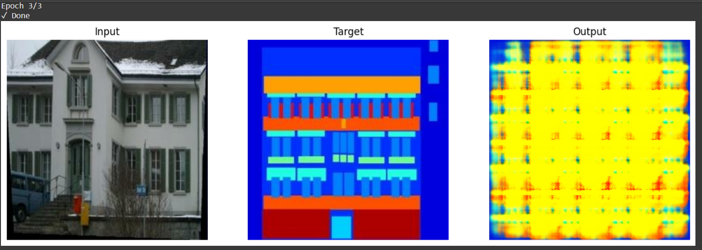

# 🧠 Task-04: Image-to-Image Translation using Pix2Pix (cGAN)

This project implements **Pix2Pix**, a Conditional GAN (cGAN) model for **image-to-image translation**, using the **Facades** dataset. The goal is to convert **building edge sketches** into **photo-realistic buildings**.

---

## 📌 Project Overview

- 📁 **Dataset:** `cycle_gan/facades` (TensorFlow Datasets)  
- 🧠 **Model:** Pix2Pix (U-Net Generator + PatchGAN Discriminator)  
- 🧪 **Input:** Edge/sketch of a building  
- 🎯 **Output:** Realistic photo of that building  
- 🛠️ **Frameworks:** TensorFlow, Colab, PIL, Matplotlib

---

## 🚀 How It Works

1. Load paired edge/photo images
2. Normalize and preprocess them
3. Build and train Pix2Pix GAN
4. Generate photo from sketch input
5. Save and download the output

---

## ▶️ Output Example

Here’s a sample result after training for a few epochs:

> 🖼️ The output shown above is saved as `task_4 output.png`.

---

